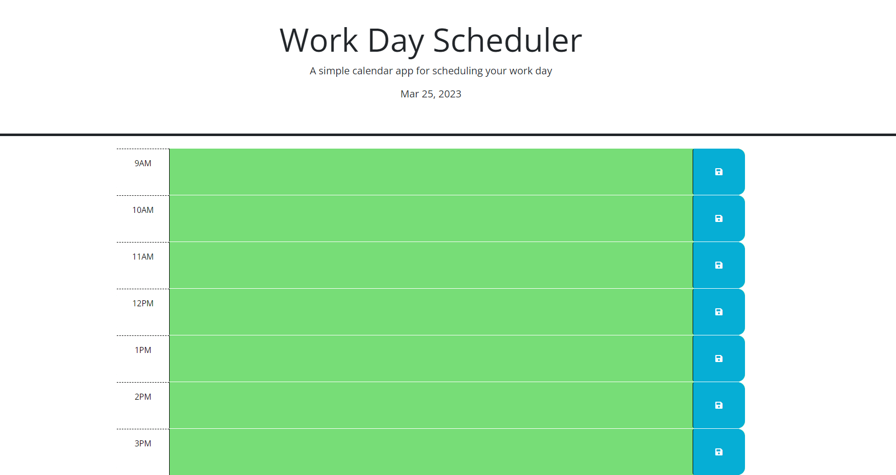

# Work Day Scheduler

## Description

This project is a simple way to keep track of your workday and see the time/date.

while building this project, I learned more about the Day.js third party API and how to better implement third party API's into my code. I learned more of how to use jQuery as well as local storage.

## Installation

N/A

## Usage

To use this website simply type your scheduled events into correlating time blocks and hit save. 

Time blocks will change color based upon current time.
Grey = past
Red = present
Green = future

## Credits

N/A

## License

None